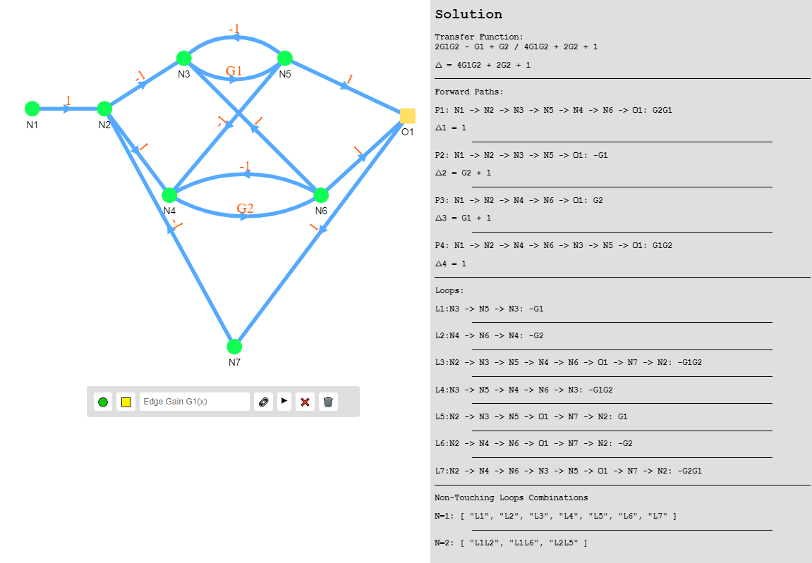
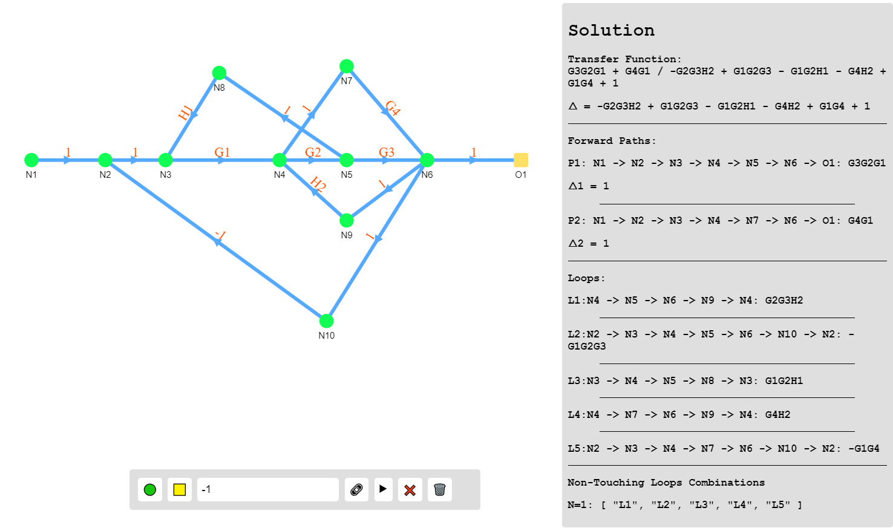
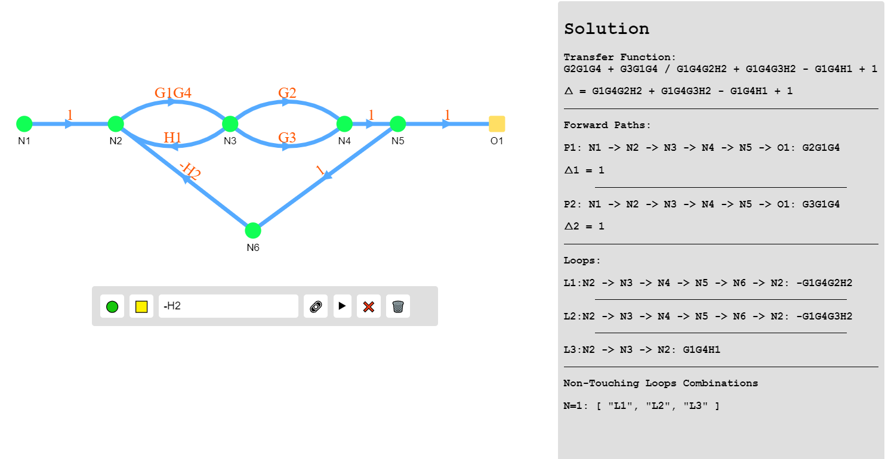
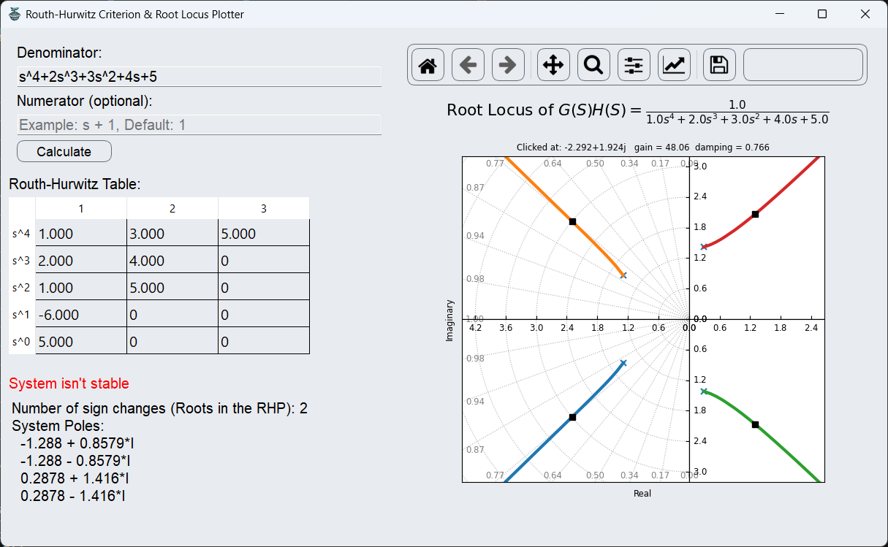
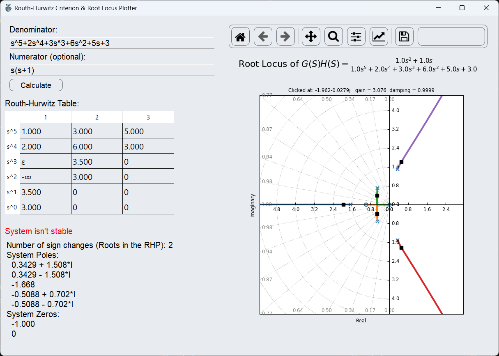

# Control Systems Analysis

# 1-Signal Flow Graphs Solver

## **Overview**

This project involves developing a software application capable of visualizing and analyzing signal flow graphs. The application will allow users to draw nodes and branch gains of a signal flow graph to provide a graphical representation of the graph, list all forward paths and loops, calculate system determinant Δ and paths determinant Δ1,Δ2..Δn , and compute the overall system transfer function. by Manon's rule.

## **Features**

1. **Dynamic UI Setup:**
    - Users can graphically add nodes via the UI, connecting them arbitrarily for a flexible simulation setup.
2. **System Analysis:**
    - The software can identify and list all forward paths, loops, and calculate determinants.
3. **Comprehensive Output:**
    - It provides a detailed system transfer function calculation using Mason's rule.
4. **Flexible Input :**
    - The user can enter the gain of edges as numbers , symbols , letters even negative letters like -H3.

### **Algorithms Implemented**

1. **Graph Traversal for Finding All Paths**:
    - **Objective**: Identify all forward paths from an input node to an output node in the signal flow graph.
    - **Method**: Depth-first search (DFS) is used to explore all possible paths from the start node to the end node. As each node is visited, it is marked to prevent revisiting, and the path is recorded. Once the target node is reached, the current path is saved as a forward path.
2. **Cycle Detection for Loops**:
    - **Objective**: Detect all feedback loops within the graph, which are critical for calculating the system’s transfer function.
    - **Method**: A modified depth-first search is used where each node starts a new DFS to find cycles. A cycle is confirmed if a node is revisited before the DFS completes. Each loop is then stored, ensuring no node in the loop has been touched by other loops' paths.
3. **Detection of Non-Touching Loops**:
    - **Objective**: Identify sets of loops that do not share common nodes, which are used to calculate the determinant of the graph.
    - **Method**: Recursive combinations are formed from the list of detected loops, and for each combination, it is checked whether they are non-touching by ensuring no common nodes are present.
4. **Calculation of Transfer Function Using Mason’s Gain Formula**:
    - **Objective**: Compute the overall system transfer function.
    - **Method**:
        - The determinant of the system is first calculated using the identified loops and their combinations.
        - For each forward path, the path gain is multiplied by the determinant of the subgraph formed by removing the nodes in the path (using non-touching loops).
        - The transfer function is the sum of these terms divided by the determinant of the entire graph.
5. **Simplification and Output Adjustment**:
    - **Objective**: Output the paths, loops, and transfer function in a readable format.
    - **Method**: Each path and loop is converted into a human-readable string showing nodes and gains. Algebra.js is used to simplify expressions and convert them to strings for display

## User Guide

1. **Adding Nodes:**
    - To add a non-output node , click the 🟢 button in the UI.
    - To add a output node , click the 🟨 button in the UI.
2. **Adding Edges (Connections):**
    - To establish connections between nodes
        - Click on the source node (from which the edge originates).
        - Press **Shift + Alt** to enable multi-selection mode.
        - Click on the target node (to which the edge connects).
        - Click the 🔗 button to create the connection.
3. **Deleting Nodes or Edges:**
    - To delete a machine, queue, or edge:
        - Click on the node or edge that you want to delete.
        - Click the ❌ button to remove the selected item.
4. **Solve the System:**
    - Ensure all connections are established correctly.
    - Click the ▶️ button to solve and show outputs
    
    ## Sample Runs
    

    

    

    
   # Routh-Hurwitz Criterion & Root Locus Plotter

## Overview

The Routh-Hurwitz Criterion & Root Locus Plotter is a Python application designed to analyze the stability and behavior of linear control systems. The application provides a graphical user interface (GUI) for easy interaction and visualization of system characteristics.

## Features

1. **Routh-Hurwitz Criterion**:
    - Calculates the Routh-Hurwitz Table based on user-provided transfer function coefficients.
    - Determines system stability by counting the number of sign changes in the first column of the Routh array.
    - Calculates the poles and zeros of the system transfer function.

2. **Root Locus Plotting**:
    - Plots the Root Locus of the given transfer function to visualize the movement of poles in the complex plane.
    - Provides insight into how system stability changes with variations in parameters.

3. **Graphical User Interface (GUI)**:
    - Intuitive GUI for inputting transfer function coefficients.
    - Displays Routh-Hurwitz Table and stability analysis results.
    - Interactive Root Locus plot for visual analysis of system behavior (gain and damping).

## **Algorithm Used:**

1. $\text{Routh-Hurwitz criterion}$
    $$
    \begin{align*}&\text{Given a characteristic polynomial: $a_n s^n + a_{n-1} s^{n-1} + \ldots + a_1 s + a_0 = 0$}\\
    &\text{The Routh-Hurwitz criterion determines the stability of a system based on the signs of the coefficients $a_i$.}\\ &\text{Construct the Routh array as follows:}\\
    &\left[
    \begin{array}{c|cccc}
    s^n & a_n & a_{n-2} & a_{n-4} & \ldots \\
    s^{n-1} & a_{n-1} & a_{n-3} & a_{n-5} & \ldots \\
    s^{n-2} & b_1 & b_2 & b_3 & \ldots \\
    s^{n-3} & c_1 & c_2 & c_3 & \ldots \\
    \vdots & \vdots & \vdots & \vdots & \ddots \\
    s^{1} & k_1 & k_2 & k_3 & \ldots \\
    s^{0} & k_3 & k_4 & k_5 & \ldots \\
    \end{array}
    \right]
    \hspace{0.5cm}\text{where: }\hspace{0.5cm}
    \begin{aligned}b_1 &= \frac{a_{n-1}a_{n-2}-a_n a_{n-3}}{a_{n-1}} \\b_2 &= \frac{a_{n-1}a_{n-4}-a_n a_{n-5}}{a_{n-1}} \\b_3 &= \frac{a_{n-1}a_{n-6}-a_n a_{n-7}}{a_{n-1}} \\\end{aligned}\\
    &\text{For stability:}\\
    &\hspace{0.5cm}\text{All elements in the first column must have the same sign.}
    \end{align*}
    $$

## User Guide

1. **Input Transfer Function**:
    - Enter the denominator polynomial
    - Enter the numerator polynomial (optional for systems without zeros)
2. **Calculate Routh-Hurwitz Table**:
    - Click the **`Calculate`** button to generate the Routh table and plot the root locus.
3. **System Behavior Analysis**:
    - click at any point on the root locus plot to display the gain and damping ratio at that point.

## Sample Runs

- $G(S)\cdot H(S) = \frac{1}{s^4+2s^3+3s^2+4s+5}$

- $G(S)\cdot H(S) = \frac{s(s+1)}{s^5+2s^4+3s^3+6s^2+5s+3}$

- $G(S)\cdot H(S) = \frac{s+5}{s^5+2s^4+24s^3+48s^2-25s-50}$

