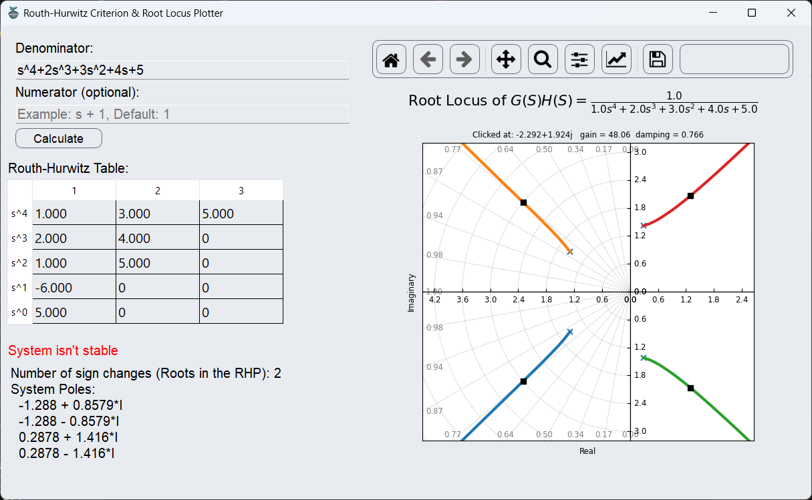
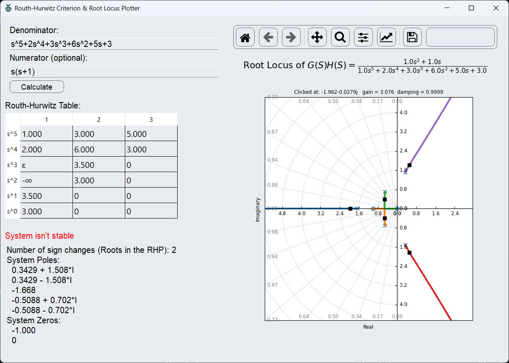
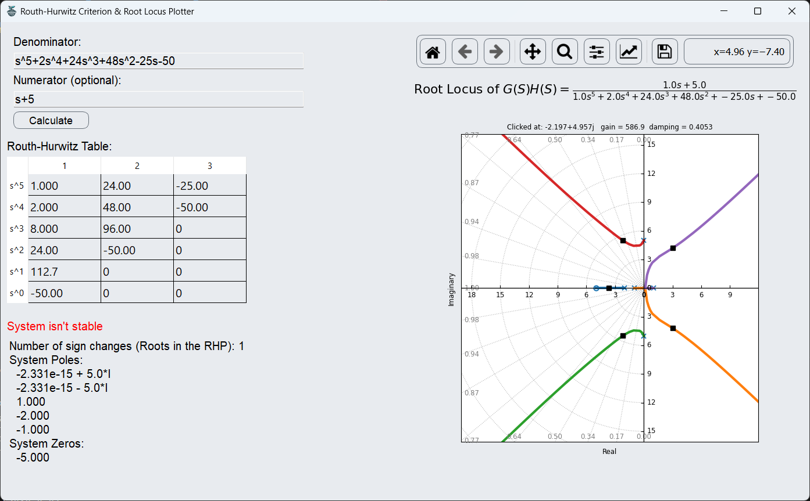

# Routh-Hurwitz Criterion & Root Locus Plotter

## Overview

The Routh-Hurwitz Criterion & Root Locus Plotter is a Python application designed to analyze the stability and behavior of linear control systems. The application provides a graphical user interface (GUI) for easy interaction and visualization of system characteristics.

## Features

1. **Routh-Hurwitz Criterion**:
    - Calculates the Routh-Hurwitz Table based on user-provided transfer function coefficients.
    - Determines system stability by counting the number of sign changes in the first column of the Routh array.
    - Calculates the poles and zeros of the system transfer function.

2. **Root Locus Plotting**:
    - Plots the Root Locus of the given transfer function to visualize the movement of poles in the complex plane.
    - Provides insight into how system stability changes with variations in parameters.

3. **Graphical User Interface (GUI)**:
    - Intuitive GUI for inputting transfer function coefficients.
    - Displays Routh-Hurwitz Table and stability analysis results.
    - Interactive Root Locus plot for visual analysis of system behavior (gain and damping).

## **Algorithm Used:**

1. $\text{Routh-Hurwitz criterion}$
    $$
    \begin{align*}&\text{Given a characteristic polynomial: $a_n s^n + a_{n-1} s^{n-1} + \ldots + a_1 s + a_0 = 0$}\\
    &\text{The Routh-Hurwitz criterion determines the stability of a system based on the signs of the coefficients $a_i$.}\\ &\text{Construct the Routh array as follows:}\\
    &\left[
    \begin{array}{c|cccc}
    s^n & a_n & a_{n-2} & a_{n-4} & \ldots \\
    s^{n-1} & a_{n-1} & a_{n-3} & a_{n-5} & \ldots \\
    s^{n-2} & b_1 & b_2 & b_3 & \ldots \\
    s^{n-3} & c_1 & c_2 & c_3 & \ldots \\
    \vdots & \vdots & \vdots & \vdots & \ddots \\
    s^{1} & k_1 & k_2 & k_3 & \ldots \\
    s^{0} & k_3 & k_4 & k_5 & \ldots \\
    \end{array}
    \right]
    \hspace{0.5cm}\text{where: }\hspace{0.5cm}
    \begin{aligned}b_1 &= \frac{a_{n-1}a_{n-2}-a_n a_{n-3}}{a_{n-1}} \\b_2 &= \frac{a_{n-1}a_{n-4}-a_n a_{n-5}}{a_{n-1}} \\b_3 &= \frac{a_{n-1}a_{n-6}-a_n a_{n-7}}{a_{n-1}} \\\end{aligned}\\
    &\text{For stability:}\\
    &\hspace{0.5cm}\text{All elements in the first column must have the same sign.}
    \end{align*}
    $$

## User Guide

1. **Input Transfer Function**:
    - Enter the denominator polynomial
    - Enter the numerator polynomial (optional for systems without zeros)
2. **Calculate Routh-Hurwitz Table**:
    - Click the **`Calculate`** button to generate the Routh table and plot the root locus.
3. **System Behavior Analysis**:
    - click at any point on the root locus plot to display the gain and damping ratio at that point.

## Sample Runs

- $G(S)\cdot H(S) = \frac{1}{s^4+2s^3+3s^2+4s+5}$
    
- $G(S)\cdot H(S) = \frac{s(s+1)}{s^5+2s^4+3s^3+6s^2+5s+3}$
    
- $G(S)\cdot H(S) = \frac{s+5}{s^5+2s^4+24s^3+48s^2-25s-50}$
    
